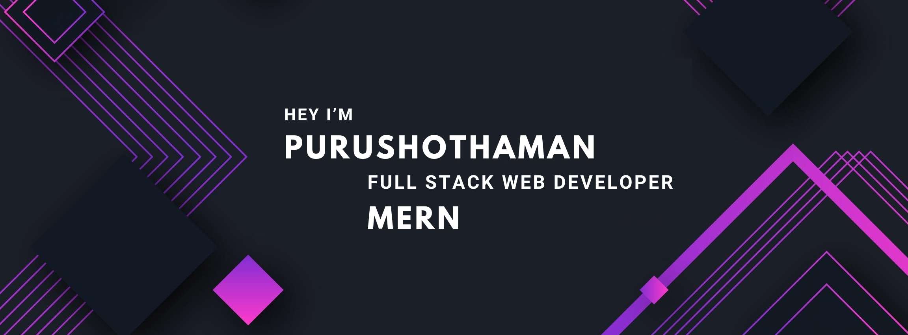

<h2 align="center">Welcome to my GitHub profile! 🚀</h2>


<p align="center">
  <a href="https://github.com/Ratheshan03/readme-typing-svg"></a>
</p>


<p align="center">
  
 <a href="https://purushothaman.netlify.app/" target="blank">
  
 </a>
  
 <a href="https://www.linkedin.com/in/purushothaman-d-32b786250" target="_blank">
  
 </a>
 

 <a href="https://twitter.com/purushoth_abi" target="_blank">
  
 </a>
 
 <a href="https://instagram.com/purushothaman_abi_?igshid=OGY3MTU3OGY1Mw==" target="_blank">
  
 </a> 
 
 <a href="https://www.facebook.com/profile.php?id=100069839256472" target="_blank">
  
  </a> 
  
</p>

<br>


<p align="center" >
  
```js
import { Person } from 'india';

const purushothaman = new Person({
    name: 'Purushothaman',
    title: 'Full Stack Developer',
    email: 'purushothaman@gmail.com',
    website: 'https://purushothaman.netlify.app/',
    status: 'studying',
});
purushothaman.sayHello = function() {
    console.log(`Hi, my name is ${this.name}, I'm a ${this.title}`);
};
purushothaman.sayHello();
```
</p>


```cmd
D:\purushothaman> node index.js
Hi, my name is Purushothaman, I'm a Full Stack Developer.

```


<br><br>

- 🚀 My favorite project is hotel booking web application using the MERN stack

- 👯‍♂️ Open to MERN stack collaborations.

- 🔧 Seeking help with Redux and MySql.

- 🌱 Learning advanced web dev.

- 💬 Ask me about web development.

- ⚡ Fun fact I learned full stack development in just 3 months!


</a>


<!--x axis divider-->


<!--h1 without bottom border-->

<!--tech stack icons-->


<h3 align="center">Skills and Tools:</h3>


 <p align="center"> Frontend</p>
<p align="center">
  <a href="https://skillicons.dev">
    
  </a>
</p>


 <p align="center"> Backend </p>
<p align="center">
  <a href="https://skillicons.dev">
    
   
    
  </a>
</p>


<p align="center"> Database and Tools </p>

<p align="center">
  <a href="https://skillicons.dev">
    
  </a>
</p>


<br/>


<!--x axis divider-->


[](https://github.com/alsiam/itasks)
[](https://github.com/alsiam/urfolio)
[](https://github.com/alsiam/web-projects)
[](https://github.com/alsiam/alsiam)


<p align="center">
  <a href="https://github.com/alsiam">
    
  </a>
</p>


<a> 
    <a href="https://github.com/alsiam"></a>
  <a href="https://github.com/alsiam"></a>
  <br/>
</a>


<p>
  Thanks for visiting my GitHub profile! If you found something interesting or have any feedback, feel free to reach out. Happy coding and see you around! 👋
</p>

<br>
<p align="right" > Created with 🧡 by <a href="http://supun.traditionalme.life">Supun Nanayakkara</a></p>
